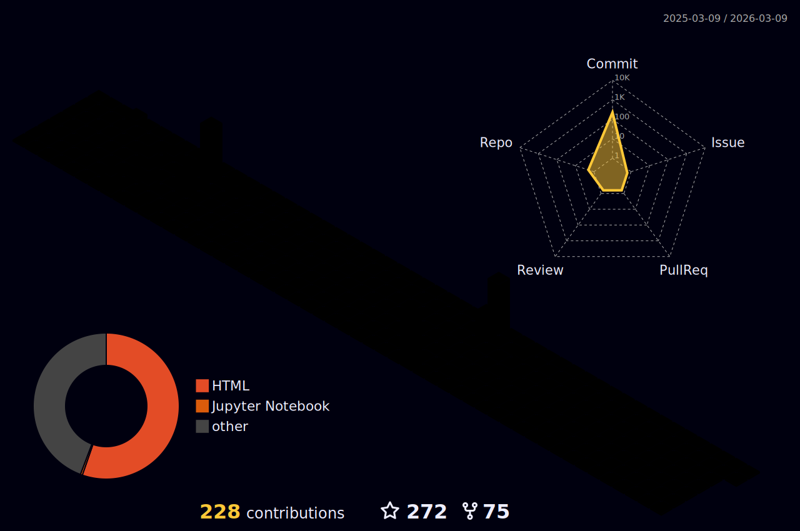

 

  
    
  
  
    
  
  
    
  

 
 

# Hi 👋 I'm Mehran 
 
A curious Digital Electronic and Machine Learning Engineer!
 
👨‍💻 I’m currently working specifically on 3D Computer Vision and Machine Learning.

🌱 My skills include Deep Learning, Machine Learning, Computer Vision, Electronics and Digital Electronics, Microcontrollers, Signal Processing, FPGA, and all things about Mathematics.
 
💬 I’m happy to answer any questions you might have about my areas of expertise.
 
📫 How to reach me: mehrant.0611@gmail.com

⚡ Fun Fact: I'm constantly exploring new technologies and improving my coding skills!
  
---
 
## Connect with Me

---

# 💻 Tech Stack:

[Resume](my link)

<!-- my-skils -->
| Property                                        | Data                                                                                                                                                                                                                                                                                                                                                                                                                                                                                                                                                                                                                                                                                                                                                                                                                                                                                                                                                                                                                                                                                                                                                                                                                                                                                                                                                                                                                                                                                                                                                                                                                                                                                                                                                                                                            |
|-------------------------------------------------|-------------------------------------------------------------------------------------------------------------------------------------------------------------------------------------------------------------------------------------------------------------------------------------------------------------------------------------------------------------------------------------------------------------------------------------------------------------------------------------------------------------------------------------------------------------------------------------------------------------------------------------------------------------------------------------------------------------------------------------------------------------------------------------------------------------------------------------------------------------------------------------------------------------------------------------------------------------------------------------------------------------------------------------------------------------------------------------------------------------------------------------------------------------------------------------------------------------------------------------------------------------------------------------------------------------------------------------------------------------------------------------------------------------------------------------------------------------------------------------------------------------------------------------------------------------------------------------------------------------------------------------------------------------------------------------------------------------------------------------------------|
| **Language / IDE**                              |    )           |
| **Domain Knowledge**                           |          |
| **CI / CD**                                     |     |
| **Tools & Platform**                            |        |
| **Machine Learning / Deep Learning frameworks** |         |

                                                                                                                                                                                                                 

# GitHub Stats

<table align="center">
  <tr>
    <td colspan="2" align="center"></td>
  </tr>
  <tr>
    <td align="center"></td>
    <td align="center"></td>
  </tr>
  <tr>
    <td align="center"></td>
    <td align="center"></td>
  </tr>
  <tr>
    <td colspan="2" align="center">
       
    </td>
  </tr>
</table>

## 🔥 My lovely snake!

##   GitHub Activity Graph 

  

---

## GitHub Trophies 🏆

---
## summary

---

Feel free to ask me about my fields of interest whenever you need!
